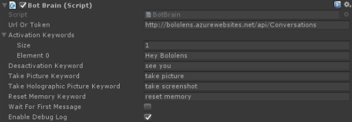

Keywords Configuration
======================

## Summary
A few keywords are necessary to first display and hide your bot also to take picture or wipe the memory of the bot.

## Unity
All the keywords can be configured on the [Brain](Brain.md) component of the bot.

## Configuration

1. **Activation Keywords**: a list of keywords to listen to in order to activate (materialize) the bot.
2. **Desactivation Keyword**: the keyword the bot is listening in order to stop the conversation.
3. **Take Picture Keyword**: the keyword responsible of making the bot take a picture and sending it to the bot framework. This picture does not contain holograms.
4. **Take Holographic Picture Keyword**: the keyword responsible of making the bot take a picture and sending it to the bot framework. This picture contains holograms.
5. **Reset Memory Keyword**: the keyword responsible of flushing the bot memory. Any information recorded locally by the bot would be deleted.