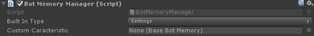

Memory
======

## Summary
**From Wikipedia**: *Memory is the faculty of the mind by which information is encoded, stored, and retrieved (Atkinson & Shiffrin, 1968). Memory is vital to experience. Without memory, we are not us. If we could not remember past events, we could not learn or develop language, relationships, nor personal identity (Eysenck, 2012).*

**Bololens**: This is the component responsible to store information from one start to another. It can keep track of the current bot feeling Matrix in order to always start back discussing with your bot in the kind of mood it was previously.
 
## Unity
The Memory is represented in Untiy by the BotMemoryManager.cs behaviour.

## Configuration

1. **Built In Type**: chose amongst the different allowed built in type of supported memory.
2. **Custom Caracteristic**: you can specify you own behaviour by extending the BaseBotMemory and referencing the game object hosting your capability here.