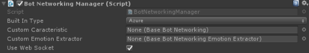

Networking
========

## Summary
**From Wikipedia**: *A computer network or data network is a telecommunications network which allows nodes to share resources. In computer networks, networked computing devices exchange data with each other using a data link. The connections between nodes are established using either cable media or wireless media. The best-known computer network is the Internet.*

**Bololens**: This is the component responsible to interact with a remote bot framework such as the Microsoft Bot Fraework.

## Unity
The Networking is represented in Untiy by the BotNetworkingManager.cs behaviour.

## Configuration

1. **Built In Type**: chose amongst the different allowed built in type of supported networking API.
2. **Custom Caracteristic**: you can specify you own behaviour by extending the BaseBotNetworking and referencing the game object hosting your capability here.
3. **Custom Emotion Extractor**: by default emotion are extracted from messages from te emoticons available in the messages. Changing this behaviour to use coginitive servicces for instance could be done by creating a behaviour inheriting from BaseBotNetworkingEmotionExtractor and referencing it here. Only one method called ExtractFeeling has to be implemented. You could genuinly wonder why to do this here ? The fact is the emotion information could be contained in none visible part of the network mesage received from the bot framework.
4. **Use Web Socket**: Specifies or not the use of Web Socket is allowed for the remote communication.

## Details
Thanks to websocket-sharp for the WebSocket cross platform implementation.   