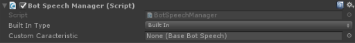

Speech
======

## Summary
**From Wikipedia**: *Visual perception is the ability to interpret the surrounding environment using light in the visible spectrum reflected by the objects in the environment.*

**Bololens**: This is the component responsible of the text to speech conversion in the application. It helps reading out loud the messages receveived by the bot.

## Unity
The Speech is represented in Untiy by the BotSpeechManager.cs behaviour.

## Configuration

1. **Built In Type**: chose amongst the different allowed built in Text to Speech APIs.
2. **Custom Caracteristic**: you can specify you own behaviour by extending the BaseBotSpeech and referencing the game object hosting your capability here.