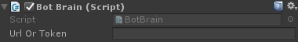
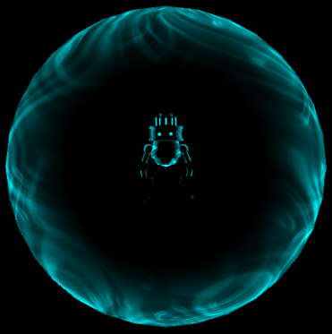

Bololens
========

## Summary
**Bot + Hololens = Bololens**

This repo provides a nice and easy integration of Chat Bot Clients in Unity application targetting UWP platforms. It is mainly developped for Hololens integration.

As bots and Conversation as a Platform are addressing a new way of interacting through Natural UI, it sounds obvious that bots could have a Digital Identity and Representation. What could be better than Mixed Reality to address the issue? 

The only currently supported bot framework is the [Microsoft Bot framework](https://dev.botframework.com/)

## TL;DR
1. Import the entire content from the **bololens.unitypackage** from the Dist folder in your Unity application.
2. Drag the **Bololens Prefab** from the Bololens/Prefabs folder in your scene.
3. Customize the **Url or Token** from the BotBrain component to either your Bot Token or a service emitting tokens.

4. Customize your **action keywords** like Activation and Desactivation in the bot brain component.

5. Run in the editor. As Text To Speech and Speech To Text are not available in the editor, you can use the **Embedded GUI** to interac with the bot.
6. Deploy in Hololens. Use **Voice Commands** through the configured Activation keywords to start discussing with your bot.
7. Voilà

## Base Principles and caracteristics
As the bot personnification is trying to mimic Natural User interactions, *His* caracteristics should be close from humans once. The bot has then be splitted in a bunch of isolated reusable and customizable sections all available through their respective Unity Components:

1. [Brain or Intelligence](Documentation/Brain.md): The orchestrator and main compute of all the other caracteristics.
2. [Materialisation](Documentation/Materialisation.md): The Digital body of the bot containing all the visualisations and animations.
3. [Hearing](Documentation/Hearing.md): The component responsible of listening for inputs (Voice or GUI).
4. [Speech](Documentation/Speech.md): This gives our bot a voice !
5. [Sight](Documentation/Sight.md): The bot can now see your world as well as holograms but still no XRay vision.
6. [Personality](Documentation/Personality.md): Depending on the messages exchanged, the bot feelings can evolve. A few Personalities are built in (Normal, Crazy...)
7. [Memory](Documentation/Memory.md): All your discussions might now have a long term impact.
8. [Networking](Documentation/Networking.md): Remote Service Connectivity providing web access to the bot.

## Going Further
1. [Keywords configuration](Documentation/KeywordsConfiguration.md)
2. [Debug configuration](Documentation/DebugConfiguration.md)
3. [Extensibility](Documentation/Extensibility.md)
4. [Limitations](Documentation/Limitations.md)

## Conclusion
A simple proof of Concept where you might find reusable component to build your own Unity Bot Client.

  

